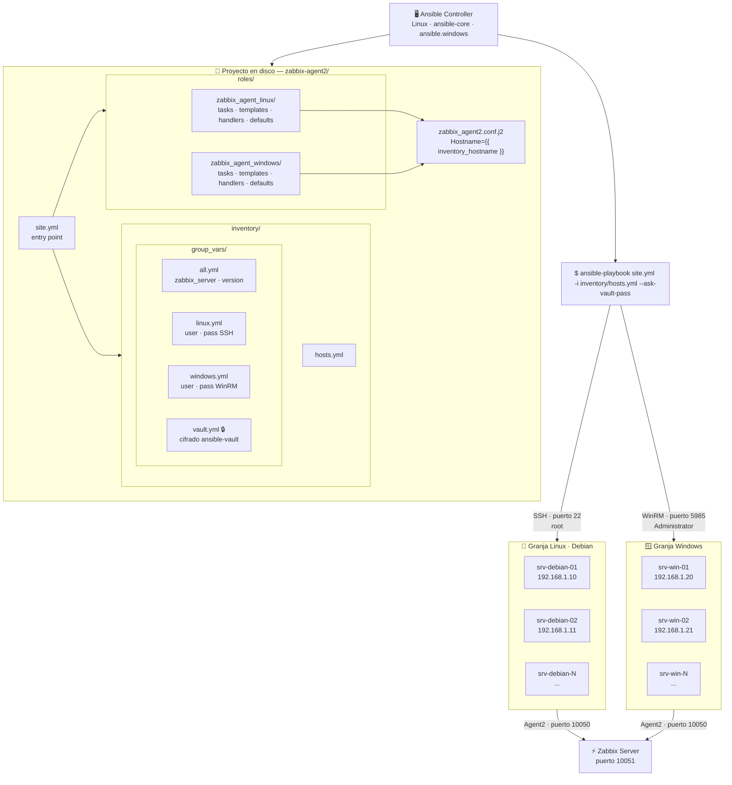
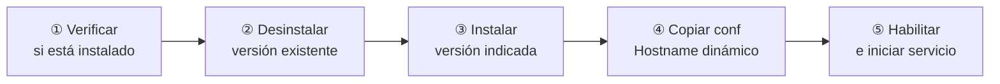

# AGP-Ansible-Claude — Zabbix Agent 2 Deployment

Playbook de Ansible para desplegar, actualizar y configurar **Zabbix Agent 2** en granjas de servidores Linux (Debian) y Windows de forma unificada.

---

## Infraestructura



---

## Flujo de tareas por servidor



---

## Estructura del proyecto

```
AGP-Ansible-Claude/
├── site.yml                          # Entry point del playbook
├── ansible.cfg                       # Configuración Ansible
├── requirements.yml                  # Colecciones necesarias
├── inventory/
│   ├── hosts.yml                     # Inventario de hosts
│   └── group_vars/
│       ├── all.yml                   # Variables globales (zabbix_server, version)
│       ├── linux.yml                 # Credenciales SSH para Linux
│       ├── windows.yml               # Credenciales WinRM para Windows
│       └── vault.yml                 # Passwords cifradas (ansible-vault) 🔒
└── roles/
    ├── zabbix_agent_linux/
    │   ├── tasks/main.yml            # apt · systemd
    │   ├── templates/zabbix_agent2.conf.j2
    │   ├── handlers/main.yml
    │   └── defaults/main.yml
    └── zabbix_agent_windows/
        ├── tasks/main.yml            # win_package · win_service
        ├── templates/zabbix_agent2.conf.j2
        ├── handlers/main.yml
        └── defaults/main.yml
```

---

## Requisitos previos

```bash
# Instalar colecciones
ansible-galaxy collection install -r requirements.yml
```

**Linux:** SSH habilitado en los servidores destino, usuario `root` accesible.

**Windows:** WinRM habilitado. Ejecutar en cada servidor Windows:
```powershell
winrm quickconfig -q
winrm set winrm/config/service/auth '@{Basic="true"}'
winrm set winrm/config/service '@{AllowUnencrypted="true"}'
```

---

## Configuración

### 1. Editar inventario

`inventory/hosts.yml` — agregar hosts con su IP:

```yaml
linux:
  hosts:
    srv-debian-01:
      ansible_host: 192.168.1.10

windows:
  hosts:
    srv-win-01:
      ansible_host: 192.168.1.20
```

### 2. Configurar variables globales

`inventory/group_vars/all.yml`:

```yaml
zabbix_server:         "IP_DEL_ZABBIX_SERVER"
zabbix_version:        "7.0"
zabbix_package_version: "7.0.*"
```

### 3. Cifrar credenciales

```bash
# Editar vault con las passwords reales
ansible-vault edit inventory/group_vars/vault.yml
```

---

## Ejecución

```bash
# Todos los servidores
ansible-playbook site.yml -i inventory/hosts.yml --ask-vault-pass

# Solo Linux
ansible-playbook site.yml -i inventory/hosts.yml --limit linux --ask-vault-pass

# Solo Windows
ansible-playbook site.yml -i inventory/hosts.yml --limit windows --ask-vault-pass

# Solo un host
ansible-playbook site.yml -i inventory/hosts.yml --limit srv-debian-01 --ask-vault-pass

# Dry-run (sin cambios reales)
ansible-playbook site.yml -i inventory/hosts.yml --check --ask-vault-pass
```

---

## Variables disponibles

| Variable | Archivo | Descripción |
|---|---|---|
| `zabbix_server` | `group_vars/all.yml` | IP del Zabbix Server |
| `zabbix_version` | `group_vars/all.yml` | Versión mayor (ej: `7.0`) |
| `zabbix_package_version` | `group_vars/all.yml` | Versión de paquete (ej: `7.0.*`) |
| `vault_linux_pass` | `group_vars/vault.yml` | Password SSH Linux |
| `vault_win_pass` | `group_vars/vault.yml` | Password WinRM Windows |
| `inventory_hostname` | automática | Nombre del host → `Hostname=` en conf |
